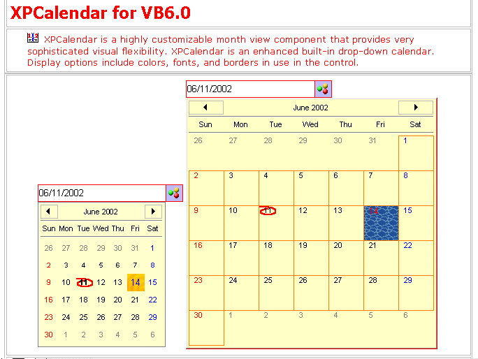



## Commercial XPCalendar

### Description

XPCalendar is a highly customizable built-in drop-down calendar that provides

very sophisticated visual flexibility.It Provides the ability to highly

customize the appearance of the control. All colors, border, and fonts

can be modified to drastically change how the control looks.Border has

up to 8 feathures,including [None], [Flat], [Raised Thin], [Sunken Thin],

[Raised 3D], [Sunken 3D], [Etched] and [Bump] .The board color can choose

with any Color.Free to set the H/V Gridline.The calendar Background can

set to any color you like.: Not only does the control support placing an

image or Grandient Color Box or simple Color Box to the the drop-down

calendar's selected cell, it supports doing this is a variety of ways.

You can tile,stretch the image with MaskColor.Defines the first day of

the week, for determining which days are the weekend. This is completely

separate from the Displayed Week Start which specifies which day of the

week to place in the drop-down calendar's first column.You can draw

transparent bitmap or Icon with Maskcolor to sign Today to make today

alert.You can position this bitmap any where you like.Default Position

is sychonized with the position of Today Text.Date Text can position

any where inside the Cell.You can align the text Center,Left and Right

plus X_Offset and Y_Offset.Use Arrow Left,Right,Up and Down to nagavite

the Date and move the Focus Highligh Bitmap or Color Box.Use <Home> and

<End> to go back to the first day or the End day of Month respectively.

Use <PgUp> and <PgDn> to increase or decrease one Month and don’t lose

the “BookMark”.

You can choose with one Mouse click or Double Click to collapse the Calendar.

And,The Calendar has True HotTracking and Hover Selection Functionality!!!

XPCalendar is totally designed for what your need!!!
 
### More Info
 

             |
---                |---
**Submitted On**   |2002-07-29 12:06:40
**By**             |[Zhu JinYong](https://github.com/Planet-Source-Code/PSCIndex/blob/master/ByAuthor/zhu-jinyong.md)
**Level**          |Intermediate
**User Rating**    |4.9 (383 globes from 78 users)
**Compatibility**  |VB 6\.0
**Category**       |[OLE/ COM/ DCOM/ Active\-X](https://github.com/Planet-Source-Code/PSCIndex/blob/master/ByCategory/ole-com-dcom-active-x__1-29.md)
**World**          |[Visual Basic](https://github.com/Planet-Source-Code/PSCIndex/blob/master/ByWorld/visual-basic.md)
**Archive File**   |[Commercial1118347292002\.zip](https://github.com/Planet-Source-Code/zhu-jinyong-commercial-xpcalendar__1-35744/archive/master.zip)

